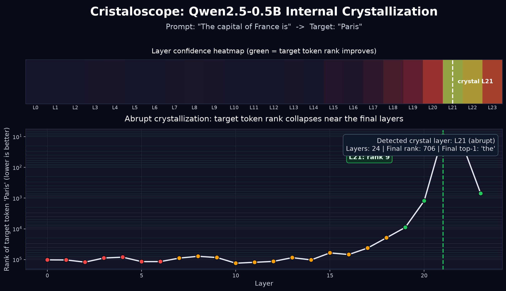

# Cristaloscope
### LLM Internal Space Visualizer & Hallucination Interceptor

Cristaloscope is a research toolkit for visualizing and intervening in the internal geometry of large language models. Built on NE-OS Research findings, it exposes three phenomena: the Three Phases of internal representation, pre-generation hallucination detection from hidden states (AUC 0.885), and surgical activation steering that corrects wrong answers without modifying model weights.

---

## Key Findings

- **Three Phases**: every LLM exhibits chaos (L0–8), semantic organization (L9–23), and crystallization (L24+) — a universal internal structure across architectures.
- **Pre-generation hallucination detection** at AUC 0.885 from hidden states at layer 12, before any token is generated.
- Only **100 of 4096 dimensions** carry the uncertainty signal — 41x compression with no information loss.
- **Activation steering** changes wrong answers to correct ones without modifying any weights.
- **Interceptor** catches 75% of hallucinations on unseen prompts (recall), trained on just 435 examples.

---

## Install

```bash
pip install git+https://github.com/rodrigoignaci0/cristaloscope
```

---

## Quick Start

### CristalAnalyzer — analyze and visualize hidden states

```python
from cristaloscope import CristalAnalyzer, CristalVisualizer

analyzer = CristalAnalyzer("Qwen/Qwen2.5-7B-Instruct")
result = analyzer.analyze(
    prompt="The capital of France is",
    answer="Paris",
    store_hidden=True,
)

print(result.crystal_layer)
print(result.crystal_type)

fig = CristalVisualizer.full_report(result)
fig.savefig("cristaloscope_report.png", dpi=150, bbox_inches="tight")
```

### ThreePhases — identify phase boundaries

```python
from transformers import AutoModelForCausalLM, AutoTokenizer
from cristaloscope import ThreePhases

model_id = "Qwen/Qwen2.5-7B-Instruct"
tokenizer = AutoTokenizer.from_pretrained(model_id, trust_remote_code=True)
model = AutoModelForCausalLM.from_pretrained(model_id, trust_remote_code=True)

phases = ThreePhases(model, tokenizer)
result = phases.analyze(
    prompt="The capital of France is",
    answer="Paris",
)

print(result["phases"])
print(result["crystal_layer"])
print(result["crystal_type"])
```

### HallucinationInterceptor — detect hallucinations before generation

```python
from transformers import AutoModelForCausalLM, AutoTokenizer
from cristaloscope import HallucinationInterceptor

model_id = "Qwen/Qwen2.5-7B-Instruct"
tokenizer = AutoTokenizer.from_pretrained(model_id, trust_remote_code=True)
model = AutoModelForCausalLM.from_pretrained(model_id, trust_remote_code=True)

interceptor = HallucinationInterceptor(model, tokenizer, layer=12)

# fit expects list of prompts and binary labels (1 = hallucination)
interceptor.fit(prompts_train, labels_train)

prediction = interceptor.predict("Who invented the telephone?")
print(prediction["score"])
print(prediction["risk"])
```

### ActivationSteering — correct outputs without touching weights

```python
from transformers import AutoModelForCausalLM, AutoTokenizer
from cristaloscope import ActivationSteering

model_id = "Qwen/Qwen2.5-7B-Instruct"
tokenizer = AutoTokenizer.from_pretrained(model_id, trust_remote_code=True)
model = AutoModelForCausalLM.from_pretrained(model_id, trust_remote_code=True)

steerer = ActivationSteering(model, tokenizer, layer=20)

# fit learns a steering vector from prompts and binary uncertainty labels
steerer.fit(prompts_train, labels_train)

text = steerer.steer("Who invented the telephone?", alpha=1.5)
print(text)
```

---

## Reproducible Smoke Test



Run the small Qwen2.5-0.5B example on CPU:

```bash
MPLCONFIGDIR=/tmp/mpl-cristaloscope python examples/qwen_0_5b_cpu.py
```

Expected output includes the detected crystal layer, final rank, top-1 token,
and a generated report at:

```text
examples/qwen_0_5b_report.png
```

---

## Research

Cristaloscope implements findings from NE-OS Research on LLM internal geometry. The Three Phases phenomenon, hallucination probe, and steering methodology were validated on:

- Qwen2.5-7B-Instruct
- Mistral-7B-v0.1
- Phi-2

The crystallization jump (abrupt emergence of the correct token at a single layer, rather than gradual convergence) was empirically confirmed across all three architectures, with cosine similarity projections > 0.99 between model families — consistent with the Platonic Representation Hypothesis.

Full methodology and experimental results available at [NE-OS Research](https://github.com/rodrigoignaci0).

---

## Citation

```bibtex
@software{cristaloscope2026,
  author = {NE-OS Research},
  title  = {Cristaloscope: LLM Internal Space Visualizer},
  year   = {2026},
  url    = {https://github.com/rodrigoignaci0/cristaloscope}
}
```
